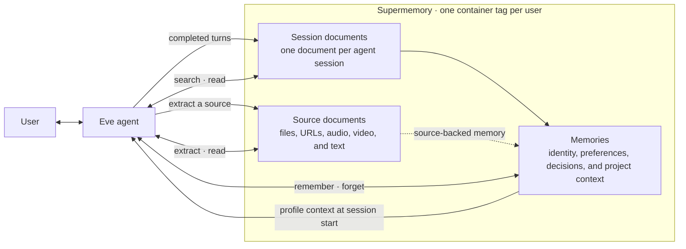

# @supermemory/eve

Memory for [Eve](https://eve.dev) agents, powered by
[Supermemory](https://supermemory.ai).

`@supermemory/eve` gives an agent continuity across sessions without making it call `remember`
after every message. It captures conversations, restores useful context, and gives the agent
deliberate ways to search, remember, extract, and forget.

```bash
npm install @supermemory/eve
```

```ts
// agent/extensions/supermemory.ts
import supermemory from "@supermemory/eve";

export default supermemory({
  apiKey: process.env.SUPERMEMORY_API_KEY!,
});
```

## How it works



A session document is the record of one agent session. New successful turns are appended to it;
failed or cancelled turns are not. Source documents hold material that SuperRAG has parsed or
transcribed for later reading. Memories are the smaller durable facts and decisions Supermemory
forms from those documents.

The container tag comes from Eve's verified caller identity. It is not chosen by the model, so two
users of the same agent do not share context. The same model works for a personal assistant, an
autonomous worker, a research agent, or a recursive agent: the architecture of the agent can change
without changing the memory primitives.

## Automatic continuity

After each successful turn, the extension appends the user and assistant messages to that session's
document. Failed and cancelled turns are discarded. Supermemory forms durable memories from
user-grounded details such as preferences, relationships, goals, decisions, constraints, and
ongoing work.

When a turn uses a Supermemory tool, retrieved material is marked as existing context. It cannot be
learned again from the assistant's response.

At the start of the next session, the agent receives a bounded profile with stable user details,
recent memories, and recent session summaries. Deeper retrieval stays on demand.

## Agent-directed memory

Skills describe the workflow. Tools perform the operation.

| Skill | Tools | Used for |
| --- | --- | --- |
| `search-memory` | `search`, `read_session`, `read_document` | Search compact results first, then read the full session or source only when the task needs it. |
| `remember-context` | `remember` | Save an explicit request, preference, decision, project state, or reusable correction as one standalone memory. |
| `extract-sources` | `extract`, `read_document` | Use SuperRAG to parse, transcribe, index, and selectively read large or unsupported sources. |
| `forget-memory` | `search`, `forget`, `forget_matching` | Remove one exact memory, or preview and confirm the precise set for a broader request. |

Mounting the extension as `supermemory.ts` adds the `supermemory__` namespace, so `search` becomes
`supermemory__search` and `search-memory` becomes `supermemory__search-memory`.

Source-backed memories keep the useful synthesis and the source document ID. The agent can answer
from the memory when it is enough and return to the original evidence when it is not.

## Design choices

- Capture does not depend on the model remembering to remember.
- Session documents preserve what was actually said; memories preserve what remains useful.
- Source documents stay available without occupying the agent's full context window.
- Skills leave retrieval and fallback decisions visible to the agent instead of hiding them in the
  extension.
- Identity and storage routing stay under developer control.
- Broad deletion always exposes the affected memories before changing them.

## Configuration

The API key is the only required option. Capture behavior and profile rendering can be adjusted at
the extension mount:

```ts
export default supermemory({
  apiKey: process.env.SUPERMEMORY_API_KEY!,
  containerTagPrefix: "agent",
  profileContext: {
    timeZone: "America/Los_Angeles",
  },
  capture: {
    enabled: true,
    dreaming: "dynamic",
    metadata: {},
  },
});
```

`capture.entityContext` can replace the default definition of durable context for products that
need a different memory policy. The model cannot change caller identity, container routing, or
capture policy at runtime.

## Development

Requires Node.js 24 or newer.

```bash
npm install
npm run check
npm run typecheck
npm run build
npm pack --dry-run
```
