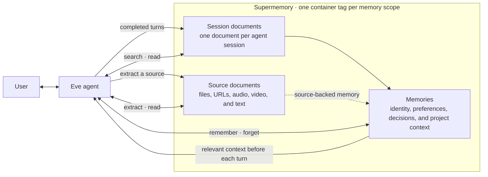

# @supermemory/eve

Memory for [Eve](https://eve.dev) agents, powered by
[Supermemory](https://supermemory.ai).

`@supermemory/eve` gives an agent continuity across sessions without making it call `remember`
after every message. It captures conversations, retrieves relevant context, and gives the agent
ways to search, remember, extract, and forget.

```bash
npm install @supermemory/eve
```

Create a memory slot in the consuming Eve agent. `supermemory(...)` configures the provider;
`defineMemory(...)` binds it to an Eve-managed scope.

```ts
// agent/memory/supermemory.ts
import supermemory from "@supermemory/eve";
import { defineMemory } from "eve/memory";
import { byPrincipal } from "eve/memory/scope";

export default defineMemory({
  description: "Recall and manage durable context for the current user.",
  provider: supermemory({
    apiKey: process.env.SUPERMEMORY_API_KEY!,
  }),
  scope: byPrincipal,
});
```

## How it works


```mermaid
flowchart LR
  U[User] <--> E["Eve agent"]

  subgraph SM["Supermemory · one container tag per memory scope"]
    S["Session documents<br/>one document per agent session"]
    D["Source documents<br/>files, URLs, audio, video, and text"]
    M["Memories<br/>identity, preferences, decisions, and project context"]
    S --> M
    D -. source-backed memory .-> M
  end

  E -->|completed turns| S
  E -->|extract a source| D
  M -->|relevant context before each turn| E
  E <-->|search · read| S
  E <-->|extract · read| D
  E <-->|remember · forget| M
```

A session document is the record of one agent session. New successful turns are appended to it;
failed or cancelled turns are not. Source documents hold material that SuperRAG has parsed or
transcribed for later reading. Memories are the smaller durable facts and decisions Supermemory
forms from those documents.

The container tag comes from Eve's opaque, locked memory-scope key. It is not chosen by the model.
The application decides whether that scope represents one user, a workspace, or another trusted
boundary; the provider uses the same key for every read and write.

## Automatic continuity

After each successful turn, the provider appends the user and assistant messages to that session's
document. Failed and cancelled turns are discarded. Supermemory forms durable memories from
user-grounded details such as preferences, relationships, goals, decisions, constraints, and
ongoing work.

When a turn uses a Supermemory tool, retrieved material is marked as existing context. It cannot be
learned again from the assistant's response.

Before each turn, automatic search retrieves context relevant to the current request. It uses the
same locked scope as capture and can be disabled in provider configuration. The agent can still use
the search and read tools when it needs broader or source-level context.

## Agent-directed memory

The provider exposes a small set of scope-bound tools for searching, reading, remembering,
extracting, and forgetting context.

| Workflow | Tools | Used for |
| --- | --- | --- |
| Search | `search`, `read_session`, `read_document` | Search compact results first, then read the full session or source only when the task needs it. |
| Remember | `remember` | Save an explicit request, preference, decision, project state, or reusable correction as one standalone memory. |
| Extract | `extract`, `read_document` | Use SuperRAG to parse, transcribe, index, and selectively read large or unsupported sources. |
| Forget | `search`, `forget`, `forget_matching` | Remove one exact memory, or preview and confirm the precise set for a broader request. |

Naming the memory slot `supermemory.ts` gives its provider tools the `supermemory__` namespace, so
`search` becomes `supermemory__search`.

Source-backed memories keep the useful synthesis and the source document ID. The agent can answer
from the memory when it is enough and return to the original evidence when it is not.

## Design choices

- Capture does not depend on the model remembering to remember.
- Session documents preserve what was actually said; memories preserve what remains useful.
- Source documents stay available without occupying the agent's full context window.
- Automatic search handles routine recall while tools support deliberate retrieval and changes.
- Identity and storage routing stay under developer control.
- Broad deletion always exposes the affected memories before changing them.

## Configuration

Provider options are passed to `supermemory(...)` inside the memory slot. Automatic search and
capture are enabled by default and can be disabled independently:

```ts
export default defineMemory({
  provider: supermemory({
    apiKey: process.env.SUPERMEMORY_API_KEY!,
    containerTagPrefix: "eve_agent",
    autoSearch: {
      enabled: true,
    },
    capture: {
      enabled: true,
      dreaming: "dynamic",
      metadata: {},
    },
  }),
  scope: byPrincipal,
});
```

`capture.entityContext` can replace the default definition of durable context for products that
need a different memory policy. The model cannot change caller identity, container routing, or
capture policy at runtime.

## Development

Requires Node.js 24 or newer.

```bash
npm install
npm run check
npm run typecheck
npm run build
npm pack --dry-run
```
