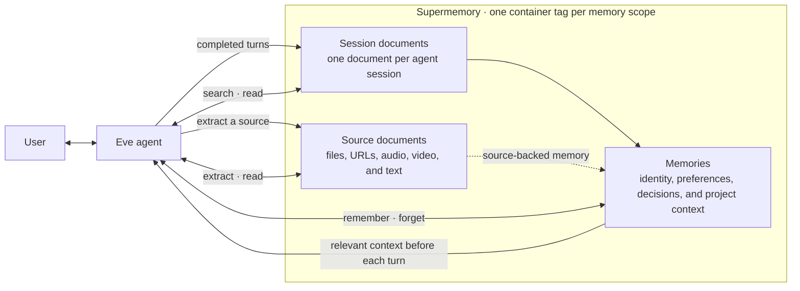

# Supermemory for Eve

`@supermemory/eve` is the first third-party implementation of
[Eve's memory-provider contract](https://eve.dev/docs/memory), powered by
[Supermemory](https://supermemory.ai).

Once mounted, it captures completed conversations, recalls useful context before each turn, and
gives Eve tools to search, remember, extract, and forget.

## Add memory to Eve

From an Eve project, add the provider from Eve's integration registry:

```bash
eve add memory/supermemory
```

Or install it yourself:

```bash
npm install @supermemory/eve
```

The provider supports Eve 0.47.3 and newer 0.x releases. Set `SUPERMEMORY_API_KEY` from the
[Supermemory console](https://console.supermemory.ai).

Create a memory slot in the consuming Eve agent. `supermemory(...)` configures the provider;
`defineMemory(...)` binds it to an Eve-managed scope.

```ts
// agent/memory/supermemory.ts
import supermemory from "@supermemory/eve";
import { defineMemory } from "eve/memory";
import { byPrincipal } from "eve/memory/scope";

export default defineMemory({
  namespace: "your-company-agent-v1",
  description: "Recall and manage durable context for the current user.",
  provider: supermemory({
    apiKey: () => process.env.SUPERMEMORY_API_KEY!,
  }),
  scope: byPrincipal,
});
```

Pass `apiKey` as a function so the key is read when the agent runs, not when `eve build` loads the
slot. A plain string also works, but then the key must be set in the build environment too.

Pick a namespace for the agent and keep it stable. If it changes, Eve sees a different memory space.
`description` is added to the tool descriptions the model sees, so keep it short and say what this
memory is for.

## How it works


```mermaid
flowchart LR
  U[User] <--> E["Eve agent"]

  subgraph SM["Supermemory · one container tag per memory scope"]
    S["Session documents<br/>one document per agent session"]
    D["Source documents<br/>files, URLs, audio, video, and text"]
    M["Memories<br/>identity, preferences, decisions, and project context"]
    S --> M
    D -. source-backed memory .-> M
  end

  E -->|completed turns| S
  E -->|extract a source| D
  M -->|relevant context before each turn| E
  E <-->|search · read| S
  E <-->|extract · read| D
  E <-->|remember · forget| M
```

A session document is the record of one agent session. New successful turns are appended to it;
failed or cancelled turns are not. Source documents hold material that SuperRAG has parsed or
transcribed for later reading. Memories are the smaller durable facts and decisions Supermemory
forms from those documents.

Eve combines the slot's namespace and trusted scope into an opaque, locked memory-scope key. The
provider derives its container tag from that key and uses it for every read and write. The
application decides whether the scope represents one user, a workspace, or another trusted
boundary; the model cannot choose or change it.

## Automatic continuity

After each successful turn, the provider appends the user and assistant messages to that session's
document. Failed and cancelled turns are discarded. Supermemory forms durable memories from
user-grounded details such as preferences, relationships, goals, decisions, constraints, and
ongoing work.

When a turn uses a Supermemory tool, retrieved material is marked as existing context. It cannot be
learned again from the assistant's response.

Before each turn, the provider loads the user's current Supermemory profile and automatically
searches for context relevant to the request. Eve runs recall again after context compaction. The
agent can still use the search and read tools when it needs broader or source-level context.

## Agent-directed memory

The provider exposes a small set of scope-bound tools for searching, reading, remembering,
extracting, and forgetting context.

| Workflow | Tools | Used for |
| --- | --- | --- |
| Search | `search`, `read_session`, `read_document` | Search compact results first, then read the full session or source only when the task needs it. |
| Remember | `remember` | Save an explicit request, preference, decision, project state, or reusable correction as one standalone memory. |
| Extract | `extract`, `read_document` | Use SuperRAG to parse, transcribe, index, and selectively read large or unsupported sources. |
| Forget | `search`, `forget`, `forget_matching` | Remove one exact memory, or preview and confirm the precise set for a broader request. |

Naming the memory slot `supermemory.ts` gives its provider tools the `supermemory__` namespace, so
`search` becomes `supermemory__search`.

Source-backed memories keep the useful synthesis and the source document ID. The agent can answer
from the memory when it is enough and return to the original evidence when it is not.

## Design choices

- Capture does not depend on the model remembering to remember.
- Session documents preserve what was actually said; memories preserve what remains useful.
- Source documents stay available without occupying the agent's full context window.
- Automatic search handles routine recall while tools support deliberate retrieval and changes.
- Identity and storage routing stay under developer control.
- Broad deletion always exposes the affected memories before changing them.

## Configuration

The namespace, description, and scope belong to the Eve memory slot. Provider options are passed to
`supermemory(...)`. Automatic search and capture are enabled by default and can be disabled
independently:

```ts
export default defineMemory({
  namespace: "your-company-agent-v1",
  description: "Recall and manage durable context for the current user.",
  provider: supermemory({
    apiKey: () => process.env.SUPERMEMORY_API_KEY!,
    containerTagPrefix: "eve_agent",
    autoSearch: {
      enabled: true,
    },
    capture: {
      enabled: true,
      dreaming: "dynamic",
      metadata: {},
    },
  }),
  scope: byPrincipal,
});
```

`capture.entityContext` can replace the default definition of durable context for products that
need a different memory policy. The model cannot change caller identity, container routing, or
capture policy at runtime.

## Frequently asked questions

### How do I add memory to Eve?

Install `@supermemory/eve`, get an API key from the
[Supermemory console](https://console.supermemory.ai), and add the memory file shown above. That's
it. Eve loads Supermemory as its memory provider.

### Why should I add memory to Eve?

Without memory, a new session starts over. Supermemory carries forward things like preferences,
decisions, project context, and earlier conversations so the agent can pick up where it left off.

### Does Eve remember conversations automatically?

With Supermemory installed, yes. Completed turns are captured automatically and useful context is
extracted from them. Failed and cancelled turns are ignored.

### How do I add RAG to an Eve agent?

Install the same provider. SuperRAG handles PDFs, URLs, images, audio, video, and text, so the agent
can index a source, search it later, and return to the original document when it needs more detail.
There is no separate RAG setup.

## Development

Requires Node.js 24 or newer.

```bash
npm install
npm run check
npm run typecheck
npm run build
npm pack --dry-run
```

### Publishing

Pushes to `main` run the release workflow. After checks and a packaged-import smoke test pass,
the workflow publishes the version in `package.json` if it is not already on npm. Bump the
package version and update `package-lock.json` to ship a new release; no Git tag is required.
Publishing uses npm trusted publishing with GitHub Actions OIDC; no `NPM_TOKEN` secret is needed.
In the npm package's trusted publisher settings, select GitHub Actions, set the organization to
`supermemoryai`, the repository to `eve-supermemory`, and the workflow filename to `release.yml`.
Leave the environment name empty and allow direct `npm publish`. The release job uses a
GitHub-hosted runner because npm trusted publishing does not support self-hosted runners.
